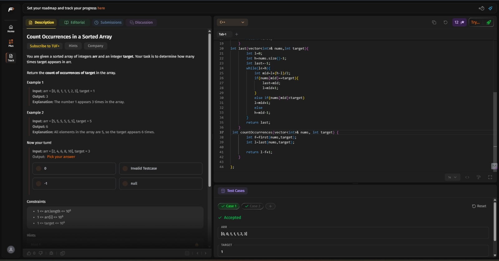
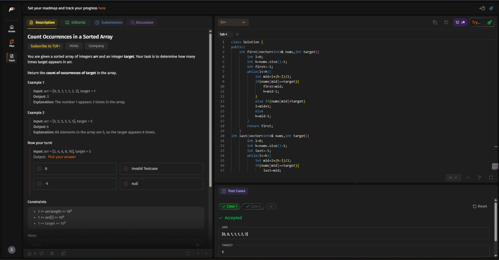

# 👋 Welcome to Vision CSE  

This repository is for the **15 Days of Code Challenge** organized by **Vision CSE** 🚀  

## 📌 About the Challenge
- Duration: **2 phases of 15 Days**
- Goal: Code every day and build consistency  
- Task: Fork this repository, and update your progress here!  

## ✅ How to Participate
1. **Fork** this repository.  
2. **Edit this README** file in your fork.  
3. Document your progress daily:  
   - Add a short note on what you did  
   - Attach screenshots or  
   - Add links to your code submissions/projects  

4. Keep pushing your changes every day!  

# DAY-1 : 12th MAY
1) Learned Git and Github
[LINK]: https://youtu.be/Ez8F0nW6S-w?si=RjQyniMk2NUskgIx
2) Revised and completed BASIC SORTINGS from striver sheet i.e
(Bubble sort , Selection sort , Insertion sort)
Done the prbs from striver sheet and learnt the concept behind it.
3) Practiced few problems in codechef:
[PRB 1]:https://www.codechef.com/practice/course/sorting/SORTING/problems/TSORT
[Solution-1]:https://www.codechef.com/viewsolution/1276347940
IN prb-1 , i am sure about my code but its showing TLE , so when i took a bit help then i realised that i didnt see constraints.
[PRB 2]:https://www.codechef.com/practice/course/sorting/SORTING/problems/CUTOFF
[Solution-2]:https://www.codechef.com/viewsolution/1276353384
[PRB 3]:https://www.codechef.com/practice/course/sorting/SORTING/problems/RACE400M
[Solution 3]:https://www.codechef.com/viewsolution/1276350211
[PRB 4]:https://www.codechef.com/practice/course/sorting/SORTING/problems/WATESTCASES
[Solution-4]:https://www.codechef.com/viewsolution/1276367044
In prb-4 , i was a having a logic but i dont think code is working out correctly.i will try again.

# DAY-2 : 13th MAY
1) learned basic recursion from striver :
[vedio link]: https://www.youtube.com/watch?v=yVdKa8dnKiE&list=PLgUwDviBIf0rGlzIn_7rsaR2FQ5e6ZOL9
2) Solved the following problems from striver A-Z sheet by basic recursion:
 a) Printing smtg N times
 b) Print linearly from 1 to N
 c) Print from N to 1
 d) Print from 1 to N (using backtracking)
 e) Print from N to 1 (using backtracking)
 f) Sum of N numbers
 g) Factorial
 h) reverse an array
 i) String is palidrome or not 
 [ques]:https://leetcode.com/problems/valid-palindrome/
 [sol]:(Tried a lot but the error is occuring.i will try again.)
 j) Fabonacci number
 [ques]:https://leetcode.com/problems/fibonacci-number/submissions/2002396179/
 [sol]:https://leetcode.com/submissions/detail/2002396179/

 The remaining questions are from striver sheet.so couldnt attach the solution link,but i have done the questions and learned the concept behind them.
 3) Attempted codechef contest - (Able to solve 3 questions)
 [sol-1]:https://www.codechef.com/viewsolution/1276790198
 [sol-2]:https://www.codechef.com/viewsolution/1276799472
 [sol-3]:https://www.codechef.com/viewsolution/1276877426

# DAY-3 : 14th MAY
1) Learned merge sort and quick sort
[qs-link]:https://www.youtube.com/watch?v=WIrA4YexLRQ
[ms-link]:https://www.youtube.com/watch?v=ogjf7ORKfd8
2) solving sorting problems in codechef
[PRB-1 QUES]:https://www.codechef.com/practice/course/sorting/SORTING/problems/WATESTCASES
[PRB-1 SOLN]:https://www.codechef.com/viewsolution/1277438707
The prb-1 was done by me on 12th may but today i got it.
[PRB-2 QUES]:https://www.codechef.com/practice/course/sorting/SORTING/problems/DSCPPAS266
[PRB-2 SOLN]:https://www.codechef.com/viewsolution/1277461103
[PRB-3 QUES]:https://www.codechef.com/practice/course/sorting/SORTING/problems/SIMPSTAT
[PRB-3 SOLN]:https://www.codechef.com/viewsolution/1277480608
Tried this prb-3,i think logic is correct but few test cases are failing.I will try again.

# DAY-4: 15th MAY
1) Solved problems from striver sheet based on topic arrays.
a)largest number
b)second largest number(learned brutal force,better and optimal methods from striver)
c)second smallest number
d)check array is sorted or not
e)remove duplicates [ques] : https://leetcode.com/problems/remove-duplicates-from-sorted-array/submissions/2004077728/
[soln]:https://leetcode.com/submissions/detail/2004077728/
f)rotation of array by k moves(Tried but it is showing runtime error) [ques]:https://leetcode.com/problems/rotate-array/
Other problems links were not in leetcode,done in VS-CODE.

# DAY-5: 16th MAY
1) Solved problems from striver sheet based on topic arrays.
a)Check array is sorted and rotated
[prb]:(https://leetcode.com/problems/check-if-array-is-sorted-and-rotated/description/)
[sol]:https://leetcode.com/submissions/detail/2004738112/

b)rotate by one place

c)rotate by k places
[prb]:https://leetcode.com/problems/rotate-array/description/
[soln]:https://leetcode.com/submissions/detail/2004554130/

d)missing number

e)move zeroes to end
[prb]:https://leetcode.com/problems/move-zeroes/description/
[soln]:https://leetcode.com/submissions/detail/2004791923/

f)linear search

g)tried max consecutive 1's (but failed test cases)
[prb]:https://leetcode.com/problems/max-consecutive-ones/submissions/2004906560/

h)union of 2 sorted arrays(learned from striver)
[link]:https://www.youtube.com/watch?v=wvcQg43_V8U&t=2584s

# DAY-6 : 17th MAY
#### Learned STL from striver (revised vectors through vedio and learned the new portion)  [STL](https://www.youtube.com/watch?v=RRVYpIET_RU) 
#### Sorry sir.Today i couldnt do much because i had an outing with my family.

# DAY-7 : 18th MAY
#### Completed some part of the OOPS concept from Love babbar  [OOPS-Lecture 42](https://www.youtube.com/watch?v=i_5pvt7ag7E&list=PLDzeHZWIZsTryvtXdMr6rPh4IDexB5NIA&index=46) 
#### Solved array problems in LEETCODE from striver sheet 
#### [Two Sum](https://leetcode.com/submissions/detail/2006291530/) 
#### [Sort Colors](https://leetcode.com/submissions/detail/2006308552/) 
#### [Majority Element](https://leetcode.com/submissions/detail/2006336609/) 
#### [Maximum Subarray](https://leetcode.com/submissions/detail/2006390775/) 
#### Solved and learned max subarray from striver also learned to print subarray which gives max sum. 
#### [Buy and sell stock](https://leetcode.com/submissions/detail/2006696925/)

# DAY-8 : 19th MAY
#### Completed OOPS concept from love babbar  [OOPS](https://www.youtube.com/watch?v=b3GccK5_KSQ) ####Solved questions from leetcode on topic arrays [Rearrange array elements by sign](https://leetcode.com/submissions/detail/2007620172/) [Next Permutation](https://leetcode.com/submissions/detail/2007631205/)   Tried Next permutation a lot , atlast learned it from striver [link](https://www.youtube.com/watch?v=JDOXKqF60RQ)

# DAY-9 : 20th MAY
#### Revised binary search from the notes and solved problems from striver sheet (Binary search on 1D ) [Search X in sorted array](https://leetcode.com/problems/binary-search/description/)-  [SOLN](https://leetcode.com/submissions/detail/2008072025/) [Lower Bound](https://takeuforward.org/plus/dsa/problems/lower-bound-?source=strivers-a2z-dsa-track)- [Upper Bound](https://takeuforward.org/plus/dsa/problems/upper-bound?source=strivers-a2z-dsa-track)- [Search insert position](https://leetcode.com/problems/search-insert-position/description/)-  [soln](https://leetcode.com/submissions/detail/2008099901/) [Floor and Ceil in Sorted Array]- [First and Last occurence](https://leetcode.com/problems/find-first-and-last-position-of-element-in-sorted-array/description/)-  [soln](https://leetcode.com/submissions/detail/2008166967/) [Count Occurrences in a Sorted Array](https://takeuforward.org/plus/dsa/problems/count-occurrences-in-a-sorted-array?source=strivers-a2z-dsa-track)-  [Search in rotated sorted array-I](https://leetcode.com/problems/search-in-rotated-sorted-array/description/)-  [soln](https://leetcode.com/submissions/detail/2008442408/)  CODECHEF CONTEST-Solved 3 problems and submitted prb-4 after the contest [prb-1](https://www.codechef.com/viewsolution/1279917725) [prb-2](https://www.codechef.com/viewsolution/1279945718) [prb-3](https://www.codechef.com/viewsolution/1280008002) [prb-4](https://www.codechef.com/viewsolution/1280046708)

# DAY-10 : 21st MAY
Done problems from the striver sheet on topic Binary search 
[Search in rotated sorted array-I](https://leetcode.com/problems/search-in-rotated-sorted-array/description/)  -  [soln](https://leetcode.com/submissions/detail/2009340292/) 
[Search in Rotated Sorted Array II](https://leetcode.com/problems/search-in-rotated-sorted-array-ii/description/)  -  [soln](https://leetcode.com/submissions/detail/2009339367/) Tried and then learned optimal method of rotated array from striver 
[Find Minimum in Rotated Sorted Array](https://leetcode.com/problems/find-minimum-in-rotated-sorted-array/description/)   -  [soln](https://leetcode.com/submissions/detail/2009148800/) 
[Find out how many times the array has been rotated] - Done from striver sheet,link not available ,done using binary search 
[fIND peak element](https://leetcode.com/problems/find-peak-element/description/)  -  [soln](https://leetcode.com/submissions/detail/2009204658/) 
[Find sqaure root of a number]-Learned how to do with binary search from striver,(prb link not found)

# DAY-11 : 22nd MAY
Tried problems on Binary search on Answers from striver sheet but couldnt make it. 
[Largest Odd Number in a String](https://leetcode.com/problems/largest-odd-number-in-string/description/)   -  [SOLN](https://leetcode.com/submissions/detail/2010186597/) 
[Longest Common Prefix](https://leetcode.com/problems/longest-common-prefix/description/)   -  [SOLN](https://leetcode.com/submissions/detail/2010203583/) 
[Find row with maximum 1's](https://takeuforward.org/plus/dsa/problems/find-row-with-maximum-1's?source=strivers-a2z-dsa-track)   -    
Started CP31 problems 
[Halloumi Boxes](https://codeforces.com/problemset/problem/1903/A)   -   [SOLN](https://codeforces.com/contest/1903/submission/375667869) 
[Line Trip](https://codeforces.com/problemset/problem/1901/A)   -   [SOLN](https://codeforces.com/contest/1901/submission/375680227)

