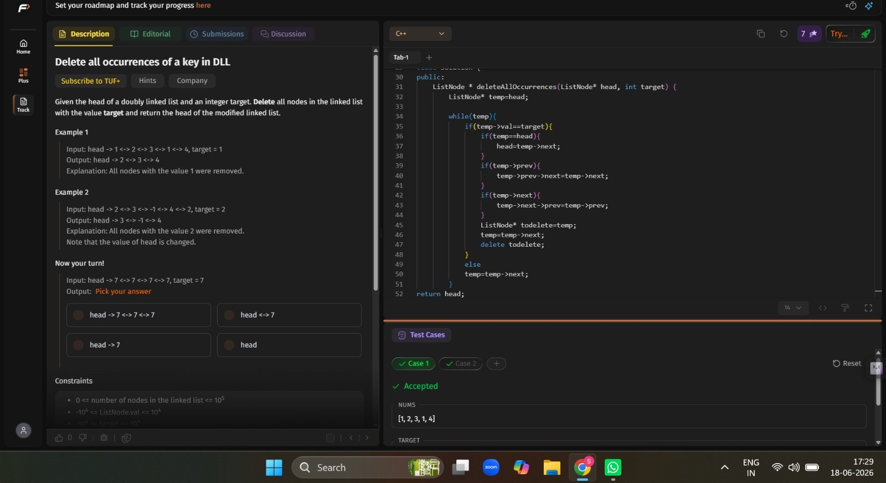

# 👋 Welcome to Vision CSE  

This repository is for the **15 Days of Code Challenge** organized by **Vision CSE** 🚀  

## 📌 About the Challenge
- Duration: **2 phases of 15 Days**
- Goal: Code every day and build consistency  
- Task: Fork this repository, and update your progress here!  

## ✅ How to Participate
1. **Fork** this repository.  
2. **Edit this README** file in your fork.  
3. Document your progress daily:  
   - Add a short note on what you did  
   - Attach screenshots or  
   - Add links to your code submissions/projects  

4. Keep pushing your changes every day!  

# DAY-1 : 12th MAY
1) Learned Git and Github
[LINK]: https://youtu.be/Ez8F0nW6S-w?si=RjQyniMk2NUskgIx
2) Revised and completed BASIC SORTINGS from striver sheet i.e
(Bubble sort , Selection sort , Insertion sort)
Done the prbs from striver sheet and learnt the concept behind it.
3) Practiced few problems in codechef:
[PRB 1]:https://www.codechef.com/practice/course/sorting/SORTING/problems/TSORT
[Solution-1]:https://www.codechef.com/viewsolution/1276347940
IN prb-1 , i am sure about my code but its showing TLE , so when i took a bit help then i realised that i didnt see constraints.
[PRB 2]:https://www.codechef.com/practice/course/sorting/SORTING/problems/CUTOFF
[Solution-2]:https://www.codechef.com/viewsolution/1276353384
[PRB 3]:https://www.codechef.com/practice/course/sorting/SORTING/problems/RACE400M
[Solution 3]:https://www.codechef.com/viewsolution/1276350211
[PRB 4]:https://www.codechef.com/practice/course/sorting/SORTING/problems/WATESTCASES
[Solution-4]:https://www.codechef.com/viewsolution/1276367044
In prb-4 , i was a having a logic but i dont think code is working out correctly.i will try again.

# DAY-2 : 13th MAY
1) learned basic recursion from striver :
[vedio link]: https://www.youtube.com/watch?v=yVdKa8dnKiE&list=PLgUwDviBIf0rGlzIn_7rsaR2FQ5e6ZOL9
2) Solved the following problems from striver A-Z sheet by basic recursion:
 a) Printing smtg N times
 b) Print linearly from 1 to N
 c) Print from N to 1
 d) Print from 1 to N (using backtracking)
 e) Print from N to 1 (using backtracking)
 f) Sum of N numbers
 g) Factorial
 h) reverse an array
 i) String is palidrome or not 
 [ques]:https://leetcode.com/problems/valid-palindrome/
 [sol]:(Tried a lot but the error is occuring.i will try again.)
 j) Fabonacci number
 [ques]:https://leetcode.com/problems/fibonacci-number/submissions/2002396179/
 [sol]:https://leetcode.com/submissions/detail/2002396179/

 The remaining questions are from striver sheet.so couldnt attach the solution link,but i have done the questions and learned the concept behind them.
 3) Attempted codechef contest - (Able to solve 3 questions)
 [sol-1]:https://www.codechef.com/viewsolution/1276790198
 [sol-2]:https://www.codechef.com/viewsolution/1276799472
 [sol-3]:https://www.codechef.com/viewsolution/1276877426

# DAY-3 : 14th MAY
1) Learned merge sort and quick sort
[qs-link]:https://www.youtube.com/watch?v=WIrA4YexLRQ
[ms-link]:https://www.youtube.com/watch?v=ogjf7ORKfd8
2) solving sorting problems in codechef
[PRB-1 QUES]:https://www.codechef.com/practice/course/sorting/SORTING/problems/WATESTCASES
[PRB-1 SOLN]:https://www.codechef.com/viewsolution/1277438707
The prb-1 was done by me on 12th may but today i got it.
[PRB-2 QUES]:https://www.codechef.com/practice/course/sorting/SORTING/problems/DSCPPAS266
[PRB-2 SOLN]:https://www.codechef.com/viewsolution/1277461103
[PRB-3 QUES]:https://www.codechef.com/practice/course/sorting/SORTING/problems/SIMPSTAT
[PRB-3 SOLN]:https://www.codechef.com/viewsolution/1277480608
Tried this prb-3,i think logic is correct but few test cases are failing.I will try again.

# DAY-4: 15th MAY
1) Solved problems from striver sheet based on topic arrays.
a)largest number
b)second largest number(learned brutal force,better and optimal methods from striver)
c)second smallest number
d)check array is sorted or not
e)remove duplicates [ques] : https://leetcode.com/problems/remove-duplicates-from-sorted-array/submissions/2004077728/
[soln]:https://leetcode.com/submissions/detail/2004077728/
f)rotation of array by k moves(Tried but it is showing runtime error) [ques]:https://leetcode.com/problems/rotate-array/
Other problems links were not in leetcode,done in VS-CODE.

# DAY-5: 16th MAY
1) Solved problems from striver sheet based on topic arrays.
a)Check array is sorted and rotated
[prb]:(https://leetcode.com/problems/check-if-array-is-sorted-and-rotated/description/)
[sol]:https://leetcode.com/submissions/detail/2004738112/

b)rotate by one place

c)rotate by k places
[prb]:https://leetcode.com/problems/rotate-array/description/
[soln]:https://leetcode.com/submissions/detail/2004554130/

d)missing number

e)move zeroes to end
[prb]:https://leetcode.com/problems/move-zeroes/description/
[soln]:https://leetcode.com/submissions/detail/2004791923/

f)linear search

g)tried max consecutive 1's (but failed test cases)
[prb]:https://leetcode.com/problems/max-consecutive-ones/submissions/2004906560/

h)union of 2 sorted arrays(learned from striver)
[link]:https://www.youtube.com/watch?v=wvcQg43_V8U&t=2584s

# DAY-6 : 17th MAY
#### Learned STL from striver (revised vectors through vedio and learned the new portion)  [STL](https://www.youtube.com/watch?v=RRVYpIET_RU) 
#### Sorry sir.Today i couldnt do much because i had an outing with my family.

# DAY-7 : 18th MAY
#### Completed some part of the OOPS concept from Love babbar  [OOPS-Lecture 42](https://www.youtube.com/watch?v=i_5pvt7ag7E&list=PLDzeHZWIZsTryvtXdMr6rPh4IDexB5NIA&index=46) 
#### Solved array problems in LEETCODE from striver sheet 
#### [Two Sum](https://leetcode.com/submissions/detail/2006291530/) 
#### [Sort Colors](https://leetcode.com/submissions/detail/2006308552/) 
#### [Majority Element](https://leetcode.com/submissions/detail/2006336609/) 
#### [Maximum Subarray](https://leetcode.com/submissions/detail/2006390775/) 
#### Solved and learned max subarray from striver also learned to print subarray which gives max sum. 
#### [Buy and sell stock](https://leetcode.com/submissions/detail/2006696925/)

# DAY-8 : 19th MAY
#### Completed OOPS concept from love babbar  [OOPS](https://www.youtube.com/watch?v=b3GccK5_KSQ) ####Solved questions from leetcode on topic arrays [Rearrange array elements by sign](https://leetcode.com/submissions/detail/2007620172/) [Next Permutation](https://leetcode.com/submissions/detail/2007631205/)   Tried Next permutation a lot , atlast learned it from striver [link](https://www.youtube.com/watch?v=JDOXKqF60RQ)

# DAY-9 : 20th MAY
#### Revised binary search from the notes and solved problems from striver sheet (Binary search on 1D ) [Search X in sorted array](https://leetcode.com/problems/binary-search/description/)-  [SOLN](https://leetcode.com/submissions/detail/2008072025/) [Lower Bound](https://takeuforward.org/plus/dsa/problems/lower-bound-?source=strivers-a2z-dsa-track)- [Upper Bound](https://takeuforward.org/plus/dsa/problems/upper-bound?source=strivers-a2z-dsa-track)- [Search insert position](https://leetcode.com/problems/search-insert-position/description/)-  [soln](https://leetcode.com/submissions/detail/2008099901/) [Floor and Ceil in Sorted Array]- [First and Last occurence](https://leetcode.com/problems/find-first-and-last-position-of-element-in-sorted-array/description/)-  [soln](https://leetcode.com/submissions/detail/2008166967/) [Count Occurrences in a Sorted Array](https://takeuforward.org/plus/dsa/problems/count-occurrences-in-a-sorted-array?source=strivers-a2z-dsa-track)-  [Search in rotated sorted array-I](https://leetcode.com/problems/search-in-rotated-sorted-array/description/)-  [soln](https://leetcode.com/submissions/detail/2008442408/)  CODECHEF CONTEST-Solved 3 problems and submitted prb-4 after the contest [prb-1](https://www.codechef.com/viewsolution/1279917725) [prb-2](https://www.codechef.com/viewsolution/1279945718) [prb-3](https://www.codechef.com/viewsolution/1280008002) [prb-4](https://www.codechef.com/viewsolution/1280046708)

# DAY-10 : 21st MAY
Done problems from the striver sheet on topic Binary search 
[Search in rotated sorted array-I](https://leetcode.com/problems/search-in-rotated-sorted-array/description/)  -  [soln](https://leetcode.com/submissions/detail/2009340292/) 
[Search in Rotated Sorted Array II](https://leetcode.com/problems/search-in-rotated-sorted-array-ii/description/)  -  [soln](https://leetcode.com/submissions/detail/2009339367/) Tried and then learned optimal method of rotated array from striver 
[Find Minimum in Rotated Sorted Array](https://leetcode.com/problems/find-minimum-in-rotated-sorted-array/description/)   -  [soln](https://leetcode.com/submissions/detail/2009148800/) 
[Find out how many times the array has been rotated] - Done from striver sheet,link not available ,done using binary search 
[fIND peak element](https://leetcode.com/problems/find-peak-element/description/)  -  [soln](https://leetcode.com/submissions/detail/2009204658/) 
[Find sqaure root of a number]-Learned how to do with binary search from striver,(prb link not found)

# DAY-11 : 22nd MAY
Tried problems on Binary search on Answers from striver sheet but couldnt make it. 
[Largest Odd Number in a String](https://leetcode.com/problems/largest-odd-number-in-string/description/)   -  [SOLN](https://leetcode.com/submissions/detail/2010186597/) 
[Longest Common Prefix](https://leetcode.com/problems/longest-common-prefix/description/)   -  [SOLN](https://leetcode.com/submissions/detail/2010203583/) 
[Find row with maximum 1's](https://takeuforward.org/plus/dsa/problems/find-row-with-maximum-1's?source=strivers-a2z-dsa-track)   -    
Started CP31 problems 
[Halloumi Boxes](https://codeforces.com/problemset/problem/1903/A)   -   [SOLN](https://codeforces.com/contest/1903/submission/375667869) 
[Line Trip](https://codeforces.com/problemset/problem/1901/A)   -   [SOLN](https://codeforces.com/contest/1901/submission/375680227)

# DAY-12 : 23rd MAY
Done sums on Binary search on answers in Leetcode 
[Koko Eating Bananas](https://leetcode.com/problems/koko-eating-bananas/description/)   -    [SOLN](https://leetcode.com/submissions/detail/2010488900/)   - Learned this sum from  striver 
[Min number of day to make m bouquets](https://leetcode.com/problems/minimum-number-of-days-to-make-m-bouquets/description/)  -  [SOLN](https://leetcode.com/submissions/detail/2010791351/) 
[Capacity to ship packages](https://leetcode.com/problems/capacity-to-ship-packages-within-d-days/description/)  -  [SOLN](https://leetcode.com/submissions/detail/2010987230/)  
#### CODECHEF PROBLEMS:
[Game of Pooks](https://www.codechef.com/viewsolution/1280941058) 
[Insert position](https://www.codechef.com/viewsolution/1281153416) 
[Coins and triangles](https://www.codechef.com/viewsolution/1281168601) 

# DAY-13 : 24th MAY
#### Done problems on Binary search on answers from striver sheet 
[Find the smallest divisor](https://leetcode.com/problems/find-the-smallest-divisor-given-a-threshold/description/)   -   [SOLN](https://leetcode.com/submissions/detail/2011836100/) 
[Kth Missing Positive Number](https://leetcode.com/problems/kth-missing-positive-number/description/)   -   [SOLN](https://leetcode.com/submissions/detail/2011872731/) 
[Book Allocation Problem](https://takeuforward.org/plus/dsa/problems/book-allocation-problem?source=strivers-a2z-dsa-track) -  Learned this problem from striver  [LECTURE-18](https://www.youtube.com/watch?v=gYmWHvRHu-s&list=PLgUwDviBIf0p4ozDR_kJJkONnb1wdx2Ma&index=70) 
[Split array - largest sum](https://leetcode.com/problems/split-array-largest-sum/description/)    -    [SOLN](https://leetcode.com/submissions/detail/2011975054/) 
[Painter's Partition]   -  (This is from striver sheet,link not available)

# DAY-14 : 25th MAY
#### Learned DOM - [LINK](https://www.youtube.com/watch?v=7zcXPCt8Ck0) 
#### Solved few problems from codechef 
[The Wave](https://www.codechef.com/viewsolution/1281801367) 
[First and last occurrence of a given array](https://www.codechef.com/viewsolution/1281811022) 
[Find minimum in a rotated sorted array](https://www.codechef.com/viewsolution/1281818664) 
#### Tried a prb in leetcode 
[Median of 2 sorted arrays](https://leetcode.com/problems/median-of-two-sorted-arrays/description/)    -    [SOLN](https://leetcode.com/submissions/detail/2012939207/)   -   Solved using union of  two sorted arrays logic as i didnt get using binary search.I will try again.

# DAY-15 : 26th MAY
#### Learned DOM - [LINK](https://www.youtube.com/watch?v=fXAGTOZ25H8&list=PLGjplNEQ1it_oTvuLRNqXfz_v_0pq6unW&index=7) 
#### Solved problems from striver sheet on binary search 
[Median of 2 sorted arrays](https://leetcode.com/problems/median-of-two-sorted-arrays/description/)    -    [SOLN](https://leetcode.com/submissions/detail/2013756940/)   -   Learned the logic from striver  -  [LINK](https://www.youtube.com/watch?v=NTop3VTjmxk&list=PLgUwDviBIf0p4ozDR_kJJkONnb1wdx2Ma&index=66) 
[Kth element of 2 sorted arrays]   -    
[Search in a 2D matrix](https://leetcode.com/problems/search-a-2d-matrix/description/)   -  [SOLN](https://leetcode.com/submissions/detail/2013864253/) 
[Search in 2D matrix - II](https://leetcode.com/problems/search-a-2d-matrix-ii/description/)   -   [SOLN](https://leetcode.com/submissions/detail/2013869163/) 
[Find Peak Element - II](https://leetcode.com/problems/find-a-peak-element-ii/description/)    -    Tried this sum but few test cases were not  passing,had to try again

## SECOND PHASE
# Day-1 : 15 June
#### Solved LEETCODE problems on the topic Linked  List from striver sheet 
[Sort LL](https://leetcode.com/submissions/detail/2033477000/)   -   Learned from striver 
[Sort a Linked List of 0's 1's and 2's]-() 
[Find the intersection point of Y LL](https://leetcode.com/submissions/detail/2033590515/) 
[Add one to a number represented by LL]   -   learned from striver  -  [link](https://www.youtube.com/watch?v=aXQWhbvT3w0) 
[Add Two Numbers](https://leetcode.com/submissions/detail/2034198064/) 

## Day-2 : 16 June
[PRB-1](https://leetcode.com/problems/reverse-nodes-in-k-group/description/)   -   [SOLN](https://leetcode.com/submissions/detail/2034808548/) 
[PRB-2](https://leetcode.com/problems/rotate-list/description/)     -    [SOLN](https://leetcode.com/submissions/detail/2034854725/) 
[PRB-3]  -  Tried a lot,implemented my idea but some keypoint is missing,later saw the vedio of striver and learned it -  [Link](https://www.youtube.com/watch?v=ykelywHJWLg) () 

## Day-3 : 18 June

#### On 17th june i coulnt do anything as i am sick,i just attempted CODECHEF  contest in the nyt.(Able to solve only 2 questions) 
[PRB-1](https://www.codechef.com/viewsolution/1290424596) 
[PRB-2](https://www.codechef.com/viewsolution/1290480399) 

#### 18th JUNE  :  Solved problems on double linked list from striver sheet. 
[PRB-1]   :     
[PRB-2]   :       
[PRB-3]   :       

#### Watched vedio of striver on BIT MANIPULATION   :   [LINK](https://www.youtube.com/watch?v=qQd-ViW7bfk) 

## Day-4 : 19th June

#### Learned Implementation of stack and queue from striver 
##### 1.Using arrays 
##### 2.Using linked list 
##### 3.Implementation of queue using stack (2-approaches) 
##### 4.Implementaiom of stack using queue 

#### [leetcode-1](https://leetcode.com/submissions/detail/2039080274/) 
#### [leetcode-2](https://leetcode.com/submissions/detail/2039067511/)

## DAY-5 : 20 June

#### 1.Learned infix to postfix conversion   -  () 
#### 2.Learned infix to prefix conversion    -   () 
#### 3.Solved leetcode problems 
[PRB-1](https://leetcode.com/submissions/detail/2039371613/) 
[PRB-2](https://leetcode.com/submissions/detail/2040090378/) 
[PRB-3](https://leetcode.com/submissions/detail/2040143085/) 
[PRB-4](https://leetcode.com/submissions/detail/2040159055/)

## DAY-6 : 22 June

#### On 21 june i have only completed remaining 4 conversions from striver sheet as i need to go for an outing. 

### 22 JUNE 
1.Solved problems from striver sheet. 
[PRB-1](https://leetcode.com/submissions/detail/2041631324/) - Done on my own , after submission learned optimal solution from striver playlist and applied on other problems. 
[PRB-2](https://leetcode.com/submissions/detail/2041896126/) 
[PRB-3]- 
[PRB-4]- 

## Day-7 : 23 June

#### Solved problems from leetcode 
[Asteroid Collision](https://leetcode.com/submissions/detail/2043389342/) 
[Sum of subarray minimums](https://leetcode.com/submissions/detail/2043512608/)  -  learned optimal soln from striver  
[Sum of subarray ranges](https://leetcode.com/submissions/detail/2043527867/) -  brutal 
[Sum of subarray ranges](https://leetcode.com/submissions/detail/2043581951/) - optimal 
[1900A](https://codeforces.com/contest/1900/submission/379939307) 
[1899A](https://codeforces.com/contest/1899/submission/379943609) 

## Day-8 : 24 June
Codeforces  :  [1896A](https://codeforces.com/contest/1896/submission/380049102) 
               [1890A](https://codeforces.com/contest/1890/submission/380053413) 
Leetcode    :  [prb-1](https://leetcode.com/submissions/detail/2044903838/) 

Codechef contest  : Able to solve 3 sums in time limit and thinking of 4th one 
[Teleport Home](https://www.codechef.com/viewsolution/1294594887) 
[Passing Chain](https://www.codechef.com/viewsolution/1294614868) 
[Carrot Collection](https://www.codechef.com/viewsolution/1294663048) 

## Day-9 : 25 June
#### Codeforces: 
[1877A](https://codeforces.com/contest/1877/submission/380076731) 
[1873C](https://codeforces.com/contest/1873/submission/380079212) 
[1866A](https://codeforces.com/contest/1866/submission/380080492) 

#### Leetcode: 
[Remove Duplicates from Sorted List](https://leetcode.com/submissions/detail/2045424668/) 
[Remove Duplicates from Sorted List II](https://leetcode.com/submissions/detail/2045469684/) 
[Palindrome Number](https://leetcode.com/submissions/detail/2045925896/) 
[Remove Element](https://leetcode.com/submissions/detail/2045936351/) 
[Length of Last Word](https://leetcode.com/submissions/detail/2045946046/) 
[Sliding Window Maximum](https://leetcode.com/submissions/detail/2046071863/) 

## Day-10 : 26 June
Leetcode 
[Generate Parentheses](https://leetcode.com/submissions/detail/2047113105/) 
[Count Good Numbers](https://leetcode.com/submissions/detail/2047088436/) 
[String to Integer (atoi)](https://leetcode.com/submissions/detail/2046790043/) 
[Plus One](https://leetcode.com/submissions/detail/2046650556/) 
[Find the Index of the First Occurrence in a String](https://leetcode.com/submissions/detail/2046592210/) 

Codeforces  -   [Soln-1862B](https://codeforces.com/contest/1862/submission/380248760) 

## Day-11 : 27 June
Leetcode 
[PRB-1](https://leetcode.com/submissions/detail/2047179089/) 
[PRB-2](https://leetcode.com/submissions/detail/2047185105/) 
[PRB-3](https://leetcode.com/submissions/detail/2047187905/) 
[PRB-4](https://leetcode.com/submissions/detail/2047190844/) 
[PRB-5](https://leetcode.com/submissions/detail/2047193802/) 
[PRB-6](https://leetcode.com/submissions/detail/2047194947/) 
[PRB-7](https://leetcode.com/submissions/detail/2047196261/) 
[Stock span prb](https://leetcode.com/submissions/detail/2048153331/) 
Learned LRU (Least Recently used) Cache logic or implementation using hashmaps and double linked list from striver. 

Codeforces  -    [1805A](https://codeforces.com/contest/1805/submission/380375121)

## Day-12 : 28 June
[Remove K Digits](https://leetcode.com/submissions/detail/2048808886/)  -   solved using stacks 
[Longest Substring Without Repeating Characters](https://leetcode.com/submissions/detail/2049314949/)   -  learned how to use two pointers and sliding window algorithm. 

## Day-13 : 29 June

Solved Leetcode prbs  : 
[Max Consecutive Ones III](https://leetcode.com/submissions/detail/2049712236/) 
[Maximum Points You Can Obtain from Cards](https://leetcode.com/submissions/detail/2049985086/) 
[Subarray Sum Equals K](https://leetcode.com/submissions/detail/2050119258/) 
[Binary Subarrays With Sum](https://leetcode.com/submissions/detail/2050167965/) 

Solved Codeforce prbs :
[1783A](https://codeforces.com/contest/1783/submission/380623273) 
[1788A](https://codeforces.com/contest/1788/submission/380627144) 